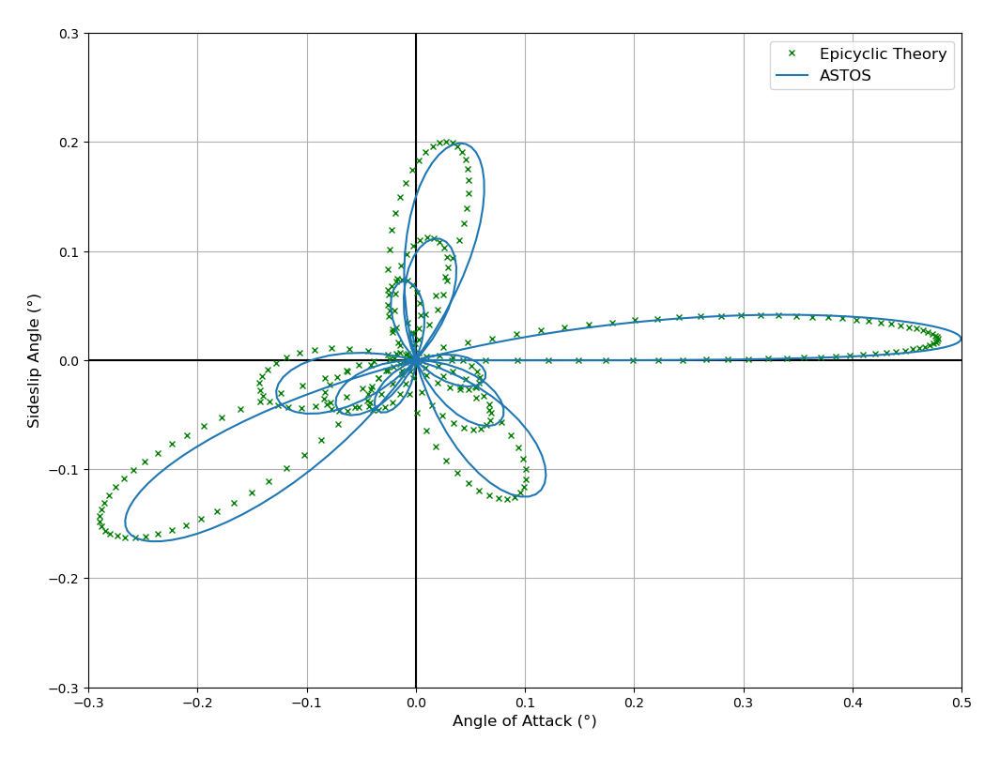

# Epicyclic Theory
The implementation of the epicyclic theory uses the sideslip rate and AOA rate from ASTOS data as well as other variables included in the Aeroballistics.csv file for validation. Run the following to obtain the visualization in the complex plane:
> python3 Main.py

